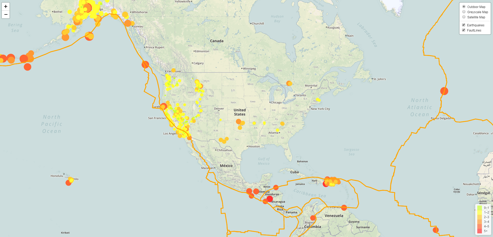

# Visualizing-Data-with-Leaflet

This project is an example of how to use Leaflet.js to visualize geoJSON data.  You can found the documentation at [Leaflet.js](https://leafletjs.com/reference-1.4.0.html). The javascript uses Leaflet layer control using basemaps and overlay maps. Below is a screenshot of the visualization.  Before opening the index.html file, be sure to add your API key to the config.js file located in static/js file path.

